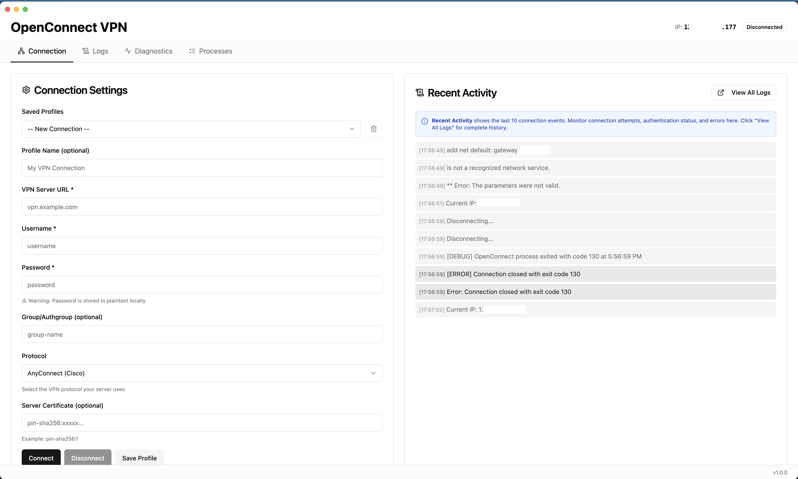
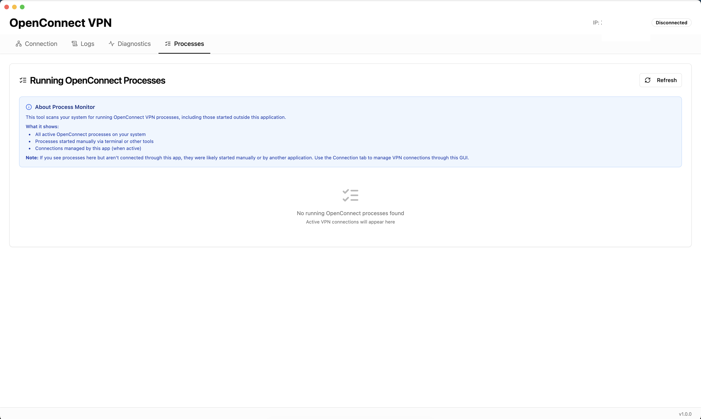

# OpenConnect VPN GUI

A modern, native macOS application for managing OpenConnect VPN connections, built with **Electron**, **React**, and **shadcn/ui**.

## Screenshots

### Connection Tab

*Multi-column layout with Connection Settings on the left and Recent Activity on the right*

### Process Monitor

*View and manage running OpenConnect processes with sudo authentication*

## Features

### Core VPN Management

- 🔐 **Secure VPN Connections** - Full OpenConnect support with interactive authentication
- 💾 **Profile Management** - Save and load multiple VPN profiles with credentials
- 🛡️ **Secure Authentication** - Expect script handles interactive prompts with proper PTY
- 🌐 **IP Address Monitoring** - Real-time public IP display before and after connection
- 🔔 **System Tray Integration** - Quick access from the menu bar

### Advanced Features

- 🧭 **Multi-Tab Interface** - Organized navigation with Connection, Logs, Diagnostics, and Processes tabs
- 🔍 **Network Diagnostics** - Detect and fix problematic network routes that block VPN connections
- 📊 **Process Monitor** - View and kill running OpenConnect processes system-wide with sudo authentication
- 📝 **Comprehensive Logging** - Real-time connection logs with extensive debugging information
- ⚡ **Lazy Loading** - Diagnostics load only when needed for better performance

### User Experience

- 🎨 **Modern UI** - Beautiful interface built with shadcn/ui and Tailwind CSS
- 🌓 **Dark Mode Support** - Seamless light/dark theme switching
- ℹ️ **Contextual Help** - In-app descriptions and usage guides for all features
- ⚙️ **System Checks** - Automatic dependency verification on startup
- 📌 **Version Display** - Footer shows current app version
- ⚡ **Fast Development** - Vite with hot module replacement

## Installation (End Users)

### Download

Download the latest `.dmg` file from [Releases](https://github.com/jadedm/openconnect-gui/releases/latest)

### Install

1. Open the DMG file
2. Drag "OpenConnect VPN" to your Applications folder
3. **Important**: Remove quarantine attribute (app is unsigned)

### ⚠️ First Launch - Bypass Security Warning

macOS will show **"OpenConnect VPN is damaged"** because the app is not code-signed.

**Choose one method:**

**Method 1: Terminal (Recommended)**
```bash
xattr -cr "/Applications/OpenConnect VPN.app"
```
Then launch the app normally from Applications.

**Method 2: Right-Click**
1. Right-click (or Control+click) on "OpenConnect VPN" in Applications
2. Click "Open"
3. Click "Open" again in the security dialog

**You only need to do this once.** Subsequent launches will work normally.

### Required Dependencies

The app will verify these on first launch:

- ✅ **OpenConnect** - VPN client (install with `brew install openconnect`)
- ✅ **expect** - Terminal automation (pre-installed on macOS)
- ✅ **Sudo access** - Required for VPN connections

## Prerequisites (Development)

### Required for Development

- **Node.js 16+** and **npm**

  ```bash
  brew install node
  ```

- **OpenConnect** - VPN client

  ```bash
  brew install openconnect
  ```

- **expect** - Usually pre-installed on macOS
  ```bash
  which expect  # Should return /usr/bin/expect
  ```

## Technology Stack

### Core

- **Electron 28** - Desktop application framework
- **React 18** - UI library with hooks
- **Vite 5** - Lightning-fast build tool and dev server

### UI Components

- **shadcn/ui** - Beautiful, accessible component library
- **Tailwind CSS** - Utility-first CSS framework
- **Radix UI** - Unstyled, accessible component primitives
- **Lucide React** - Icon library

### Authentication

- **expect** - Automated interactive authentication with proper PTY handling
- **vpn-connect.exp** - Custom expect script for OpenConnect

## Development Setup

1. Clone the repository:

   ```bash
   git clone <repository-url>
   cd openconnect-gui
   ```

2. Install dependencies:

   ```bash
   npm install
   ```

3. Install OpenConnect:
   ```bash
   brew install openconnect
   ```

## Running the Application

To start the application in development mode (with hot reload):

```bash
npm start
```

This will:

1. Start the Vite dev server on `http://localhost:5173`
2. Launch Electron with React hot module replacement enabled
3. Open the application with live reloading on code changes

## Building for Distribution

### Building the DMG

1. **Add an icon** (optional):

   ```bash
   # Download a shield icon in .icns format
   # Place it at: build/icon.icns
   ```

2. **Build and package**:

   ```bash
   npm run package
   ```

3. **Output**:
   - DMG file: `dist/OpenConnect VPN-1.0.0-arm64.dmg` (Apple Silicon)
   - Size: ~220 MB (includes Electron runtime)

### Building for Intel Macs

```bash
npx electron-builder --mac dmg --x64
```

### Code Signing (Optional)

To distribute outside the Mac App Store, you'll need:

- Apple Developer account
- Developer ID certificate

The app currently builds unsigned. Users will need to right-click → Open on first launch.

## Usage

### Application Interface

The application features a clean tab-based interface:

1. **Connection** - VPN connection settings and recent activity
2. **Logs** - Complete connection history and debugging information
3. **Diagnostics** - Network troubleshooting and route management
4. **Processes** - View running OpenConnect processes

### Connecting to a VPN

#### From the Connection Tab:

1. **Enter Connection Details:**

   - Server URL (e.g., `https://vpn.example.com:443`)
   - Username
   - Password
   - Protocol (AnyConnect, GlobalProtect, Fortinet, etc.)
   - Auth Group (optional)
   - Server Certificate Pin (optional, format: `pin-sha256:...`)

2. **Click Connect**

   - You'll be prompted for your macOS administrator password
   - OpenConnect requires sudo privileges to create VPN connections

3. **Monitor Connection**
   - Status badge changes: "Disconnected" → "Connecting" → "Connected"
   - IP address updates automatically in the header (before/after connection)
   - Recent activity shows the last 10 log entries on the right
   - Click "View All Logs" to see complete connection history

### Saving Profiles

1. Fill in the connection form
2. Enter a **Profile Name**
3. Click **Save Profile**

**⚠️ Security Warning:** Passwords are stored in plaintext in a local JSON file. For better security, leave the password field empty in saved profiles and enter it manually each time you connect.

### Using Saved Profiles

1. Select a profile from the dropdown menu
2. The form will auto-fill with saved credentials
3. Click **Connect**

### Deleting Profiles

1. Select a profile from the dropdown
2. Click the trash icon (🗑️) next to the dropdown

### Using Network Diagnostics

The **Diagnostics** tab helps troubleshoot VPN connection issues:

**Features:**

- **VPN Server Connectivity** - Test if your server is reachable
- **Network Interfaces** - View active network adapters and IPs
- **Route Detection** - Automatically identifies problematic network routes
- **Route Deletion** - Remove stale routes that block connections

**Common Scenario:**
If you recently switched networks (e.g., from mobile hotspot to WiFi), you may have stale routes. The diagnostics tab will highlight these in red with a "Delete" button.

**To Delete a Route:**

1. Navigate to the Diagnostics tab
2. Problematic routes are highlighted in red
3. Click "Delete" on the problematic route
4. Enter your sudo password in the modal
5. Route is removed and diagnostics refresh automatically

### Monitoring Processes

The **Processes** tab shows all OpenConnect processes:

**What it shows:**

- Processes started by this application
- Processes started manually via terminal
- Processes started by other VPN tools

**How to use:**

1. Click the Processes tab
2. Processes load automatically on first visit
3. Click "Refresh" to update the list
4. Badge in navigation shows count of active processes

**Killing Processes:**

1. Click the "Kill" button next to any process
2. Enter your sudo password in the modal
3. Process is forcefully terminated with SIGKILL (-9)
4. Process list automatically refreshes

⚠️ **Warning**: Killing processes forcefully terminates VPN connections and may result in data loss.

### Viewing Connection Logs

The **Logs** tab provides comprehensive connection history:

**Features:**

- All OpenConnect output in real-time
- Expect script messages prefixed with `[EXPECT]`
- Error messages prefixed with `[ERROR]`
- Debug information prefixed with `[DEBUG]`
- Copy all logs to clipboard with "Copy" button
- Clear logs with "Clear" button

**Recent Activity (Connection Tab):**

- Shows last 10 log entries
- Quick view while managing connections
- Click "View All Logs" to jump to Logs tab

## File Structure

```
openconnect-gui/
├── main.js                      # Electron main process
├── preload.js                   # Secure IPC bridge
├── vpn-connect.exp              # Expect script for authentication
├── package.json                 # Dependencies and build config
├── vite.config.js               # Vite configuration
├── tailwind.config.js           # Tailwind CSS config
├── build/
│   └── icon.icns                # App icon
├── pages/
│   ├── index.html               # Main window
│   ├── splash.html              # Startup splash screen
│   ├── installer-helper.html   # OpenConnect installer
│   └── password-prompt.html    # Sudo password prompt
├── src/
│   ├── App.jsx                  # Main app component with tab navigation
│   ├── main.jsx                 # React entry point
│   ├── globals.css              # Global styles
│   └── components/
│       ├── Navigation.jsx       # Tab navigation component
│       ├── ConnectionForm.jsx   # VPN connection form
│       ├── BasicLogs.jsx        # Recent activity (last 10 logs)
│       ├── LogsPanel.jsx        # Full connection logs
│       ├── DiagnosticsPanel.jsx # Network diagnostics and route management
│       ├── ProcessMonitor.jsx   # Running processes viewer
│       ├── RouteDeleteModal.jsx # Sudo password modal for route deletion
│       ├── KillProcessModal.jsx # Sudo password modal for killing processes
│       ├── Alert.jsx            # Alert notifications
│       └── ui/                  # shadcn/ui components
└── scripts/
    ├── install-openconnect.sh
    └── create-tray-icon.js
```

## How It Works

### Architecture

1. **Main Process** (`main.js`):

   - Manages Electron application lifecycle
   - Performs startup system checks (OpenConnect, expect, sudo access)
   - Spawns OpenConnect via expect script for proper PTY handling
   - Handles IPC communication with React renderer
   - Manages system tray integration
   - Stores/loads connection profiles to `~/Library/Application Support`

2. **Expect Script** (`vpn-connect.exp`):

   - Creates proper pseudo-terminal (PTY) for OpenConnect
   - Handles interactive sudo password prompt
   - Sends VPN username and password at correct prompts
   - Detects authentication failures and timeouts
   - Keeps connection alive after establishment

3. **Preload Script** (`preload.js`):

   - Secure IPC bridge using context isolation
   - Exposes whitelisted APIs: `connectVPN`, `disconnectVPN`, `getStatus`, etc.
   - Event listeners for status changes and log messages

4. **React Frontend** (`src/`):
   - Modern component-based UI with shadcn/ui and tab navigation
   - Real-time status updates and connection logs
   - Profile management (save/load/delete)
   - IP address monitoring (fetches from ipify.org)
   - Network diagnostics with route detection and management
   - Process monitoring (shows all running OpenConnect instances)
   - Contextual help and usage guides
   - Dark mode support

### Authentication Flow

1. User enters credentials and clicks Connect
2. App prompts for sudo password (macOS dialog)
3. Expect script spawns `sudo openconnect` with credentials
4. Script detects and handles prompts:
   - Sudo password → Sends sudo password
   - Username prompt → Sends VPN username
   - Password prompt → Sends VPN password
5. Connection established or error reported
6. IP address refreshed to show new VPN IP

### Network Diagnostics Flow

1. User navigates to Diagnostics tab (lazy loads on first visit)
2. App fetches network information:
   - Routing table (`netstat -rn`)
   - Network interfaces (`ifconfig`)
   - VPN server connectivity test (`nc -zv`)
3. Routes are analyzed for problems:
   - Gateway IPs that don't match current network interfaces
   - Routes pointing to unreachable private networks
   - Stale routes from previous VPN connections or network changes
4. Problematic routes highlighted in red with "Delete" button
5. User clicks "Delete" → Modal prompts for sudo password
6. Route deleted via `sudo route delete <destination>`
7. Diagnostics automatically refresh to show updated routes

### Security Considerations

- ✅ **Context Isolation** - Renderer can't access Node.js directly
- ✅ **IPC Whitelisting** - Only approved APIs exposed
- ✅ **Input Validation** - All user inputs validated before use in system commands
- ✅ **Command Injection Prevention** - PID, route destinations, and network parameters strictly validated
- ✅ **Sudo Authentication** - Passwords passed securely via stdin, user prompted each time
- ✅ **Proper PTY** - Expect script prevents credential leakage in logs
- ✅ **Safe Command Execution** - Uses `spawn()` with argument arrays instead of shell string interpolation
- ⚠️ **Password Storage** - Stored in plaintext JSON (consider macOS Keychain for production)

## Troubleshooting

### System Check Failures

The app performs startup checks for:

- **OpenConnect** - Install with `brew install openconnect`
- **expect** - Should be pre-installed at `/usr/bin/expect`
- **Sudo access** - User must be in admin group

### Connection Issues

**"Incorrect sudo password" error:**

- Verify you're entering your macOS login password
- Check logs for `[EXPECT ERROR]` messages

**"VPN authentication failed":**

- Verify VPN username and password
- Check server URL format (e.g., `https://vpn.example.com:443`)
- Confirm server certificate pin if using `--servercert`

**"Failed to connect" or "Can't assign requested address":**

- This is often caused by stale network routes
- Go to the **Diagnostics** tab
- Look for routes highlighted in red (problematic routes)
- Click "Delete" on problematic routes and enter your sudo password
- Common example: Route to `172.20.10.1` when you're not on that network anymore

**Connection succeeds but no internet:**

- Check logs for vpnc-script errors
- Route configuration may have failed but tunnel is established
- Use the Diagnostics tab to verify your routes
- Try manual route: `sudo route add -net 0.0.0.0/0 <gateway>`

**"expect script not found" in production:**

- The DMG build should include vpn-connect.exp in extraResources
- Check: `/Applications/OpenConnect VPN.app/Contents/Resources/vpn-connect.exp`

### Stale VPN Processes

If the **Processes** tab shows unexpected OpenConnect processes:

**Option 1: Via App UI (Recommended)**

1. Go to the **Processes** tab
2. Click the **Kill** button next to the process you want to terminate
3. Enter your sudo password in the modal
4. Process will be forcefully terminated and list will refresh

**Option 2: Via Terminal**

```bash
# View all OpenConnect processes
ps aux | grep openconnect | grep -v grep

# Kill specific process by PID
sudo kill -9 <PID>

# Or kill all OpenConnect processes
sudo pkill -9 openconnect
```

**Option 3: System Monitor**

- Open Activity Monitor
- Search for "openconnect"
- Force quit the process

### App Won't Open on macOS

**"OpenConnect VPN is damaged" error:**

- App is not code-signed
- Right-click → Open (first launch only)
- Or: `xattr -cr "/Applications/OpenConnect VPN.app"`

## Data Storage

Connection profiles are stored in:

```
~/Library/Application Support/openconnect-gui/profiles.json
```

This file contains usernames, passwords, and server information in plaintext. Protect this file accordingly.

## Development

### Debug Mode

To open the developer tools:

- macOS: `Cmd + Option + I`
- Or add `mainWindow.webContents.openDevTools();` to `main.js`

### Logs

Application logs from the main process are visible in the terminal where you ran `npm start`.

## Known Limitations

- ⚠️ **Password Storage** - Passwords stored in plaintext JSON
- ⚠️ **macOS Only** - Designed for macOS (expect script, sudo dialogs)
- ⚠️ **Unsigned App** - Requires right-click → Open on first launch
- ⚠️ **Username/Password Only** - Certificate auth not yet supported
- ⚠️ **No Auto-Reconnect** - Must manually reconnect if VPN drops

## Completed Features

### Core Functionality

- ✅ Expect script for proper interactive authentication
- ✅ Real-time IP address monitoring
- ✅ Profile management with local storage
- ✅ System dependency checks on startup
- ✅ System tray integration

### User Interface

- ✅ Multi-tab navigation (Connection, Logs, Diagnostics, Processes)
- ✅ Modern UI with shadcn/ui and Tailwind CSS
- ✅ Dark mode support
- ✅ Contextual help and usage guides
- ✅ Consistent icon system across all components

### Advanced Features

- ✅ Network diagnostics with route detection
- ✅ Automatic problematic route identification
- ✅ Sudo-authenticated route deletion from UI
- ✅ Process monitoring and detection (separate tab)
- ✅ Process killing with sudo authentication
- ✅ Command injection prevention with input validation
- ✅ Extensive error logging with context-aware messages
- ✅ Lazy loading for performance optimization
- ✅ Recent activity quick view (last 10 logs)

## Future Enhancements

### Security

- [ ] macOS Keychain integration for secure password storage
- [ ] Certificate-based authentication support
- [ ] Multi-factor authentication (MFA/2FA) support
- [ ] Import/export profiles (encrypted)

### Connectivity

- [ ] Auto-reconnect on disconnect with configurable retry
- [ ] Network change detection and automatic reconnection
- [ ] Connection speed/data usage monitoring
- [ ] Multiple simultaneous VPN connections
- [ ] Custom vpnc-script support
- [ ] Split tunneling configuration

### Diagnostics

- [ ] Automatic route repair suggestions
- [ ] DNS leak testing
- [ ] Network speed testing while connected
- [ ] MTU optimization recommendations
- [ ] VPN server latency monitoring

### User Experience

- [ ] Connection history with timestamps
- [ ] Favorite/pinned profiles
- [ ] Quick connect from system tray
- [ ] Notification center integration
- [ ] Keyboard shortcuts

## License

MIT

## Contributing

Contributions are welcome! Please feel free to submit a Pull Request.
