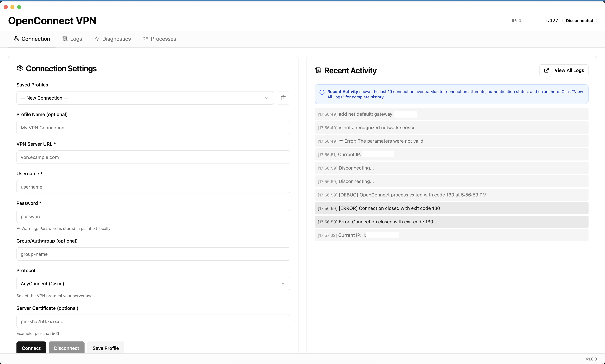
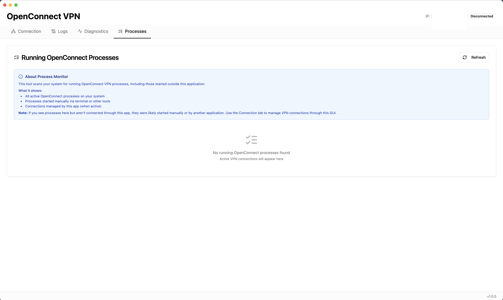

# OpenConnect VPN GUI

A macOS desktop app for connecting to VPNs with [OpenConnect](https://www.infradead.org/openconnect/). It wraps the `openconnect` command line client in a window with saved profiles, live logs, route diagnostics and a process list. Built with Electron, React and shadcn/ui.

## Screenshots

### Connection tab

Connection settings on the left, recent activity on the right.

### Processes tab

Running OpenConnect processes, with a Kill button that asks for your sudo password.

## What it does

- Connects with a username and password over seven protocols: AnyConnect (Cisco), Juniper Network Connect, GlobalProtect (Palo Alto), Pulse Connect Secure, F5 Big-IP, Fortinet and Array Networks.
- Saves connection profiles and fills the form from them.
- Shows your public IP before and after connecting (looked up from ipify.org).
- Streams OpenConnect output to a Logs tab, with the last 10 entries on the Connection tab.
- Flags network routes left over from a previous network, a common cause of failed connections after switching networks, and deletes them.
- Lists OpenConnect processes, including ones started from a terminal or another tool, and kills them.
- Checks for OpenConnect and `expect` at startup, and warns if your account is not an administrator.
- Puts an icon in the menu bar. Its menu shows the connection status and has Show Window and Quit.

## Install

1. Download the `.dmg` from [Releases](https://github.com/jadedm/openconnect-gui/releases). The published build is for Apple Silicon; on an Intel Mac, build it yourself (see Development).
2. Open it and drag "OpenConnect VPN" into Applications.
3. Install OpenConnect if you do not have it:

   ```bash
   brew install openconnect
   ```

`expect` ships with macOS. Your account needs to be an administrator, because OpenConnect runs under `sudo`.

### First launch

The published build is not code-signed, so macOS reports "OpenConnect VPN is damaged" and refuses to open it. Clear the quarantine flag once:

```bash
xattr -cr "/Applications/OpenConnect VPN.app"
```

Or right-click the app in Applications, choose Open, then Open again in the dialog. Later launches work normally.

## Usage

The window has four tabs: Connection, Logs, Diagnostics and Processes.

### Connect

1. Fill in the Connection tab:
   - Server URL, for example `https://vpn.example.com:443`
   - Username and password
   - Protocol (defaults to AnyConnect)
   - Group or authgroup, if your server uses one
   - Server certificate, if you need to pin it, for example `pin-sha256:...`. It is passed to `openconnect --servercert`. Avoid spaces, `[`, `]`, `$` and `;` in the server, group and certificate fields until [#10](https://github.com/jadedm/openconnect-gui/issues/10) is fixed.
2. Click Connect. The app opens its own window asking for your macOS password, which it needs to run OpenConnect with `sudo`.
3. The status badge moves from Disconnected to Connecting to Connected, and the IP in the header updates.

### Profiles

Enter a profile name and click Save Profile. Pick a saved profile from the dropdown to fill the form, or click the trash icon next to it to delete it.

Profiles are stored in plaintext, password included. To keep the password out of the file, leave the password field empty before saving and type it in each time you connect.

### Diagnostics

Opening the Diagnostics tab lists network interfaces (`ifconfig`), reads the routing table (`netstat -rn`), and, if the Connection form has a server URL, tests whether that server is reachable (`nc -zv`).

A route is marked in red with a Delete button when its gateway is a private address (`10.x`, `172.16.x` to `172.31.x`, `192.168.x`) whose first three numbers match none of your interface addresses. That usually means it is left over from another network, for example a phone hotspot. The check assumes every network is a `/24`, so it can flag a valid route on a larger network, and it never flags public gateways ([#11](https://github.com/jadedm/openconnect-gui/issues/11)).

Delete asks for your sudo password and runs `sudo route delete <destination>`. It only accepts `default` or a full four-part address such as `172.20.10.0/28`; routes that `netstat` prints in short form, like `10/8`, fail with "Invalid destination format" and have to be removed from a terminal.

### Processes

The Processes tab loads when you first open it and lists running processes whose command line matches `sudo ... openconnect`, `/usr/...openconnect` or `/opt/...openconnect`. One connection from this app shows as several rows (sudo, openconnect and the connection script), and the badge on the tab counts all of them ([#13](https://github.com/jadedm/openconnect-gui/issues/13)). Kill asks for your sudo password and sends `SIGKILL`, which drops that VPN connection immediately.

In the installed app this tab currently shows your sudo password, VPN username and VPN password while you are connected. Do not open it while sharing your screen until [#4](https://github.com/jadedm/openconnect-gui/issues/4) is fixed.

### Logs

The Logs tab shows all OpenConnect output as it arrives. Lines from the connection script start with `[EXPECT]`, errors with `[ERROR]` and debug detail with `[DEBUG]`. It keeps the last 500 lines. Copy puts them on the clipboard; Clear removes them and leaves a single "Logs cleared" line.

## Troubleshooting

**Startup check fails.** Install OpenConnect with `brew install openconnect`. `expect` should be at `/usr/bin/expect`. The checks stop at the first failure, so fix it and relaunch to see the rest. A missing admin membership is only a warning.

**"Connection failed. This may be due to incorrect sudo password or network issues."** The app shows this one message for every failed connect ([#9](https://github.com/jadedm/openconnect-gui/issues/9)). The Logs tab has the real cause on an `[EXPECT ERROR]` line:

- `Incorrect sudo password`: enter your macOS login password, not the VPN password.
- `VPN authentication failed`: check the VPN username and password, the server URL, and the certificate pin if you set one.
- `Network connection failed before authentication` or `Timeout waiting for ...`: the server did not answer. Check the URL and try Diagnostics.

**"Failed to connect" or "Can't assign requested address".** Usually a stale route. Open Diagnostics and delete the routes marked in red. A typical one is a route to `172.20.10.1` left over from a phone hotspot.

**Connected but no internet.** The tunnel is up but route setup failed. Look for `vpnc-script` errors in the logs and check routes in Diagnostics. As a last resort you can add a default route by hand: `sudo route add -net 0.0.0.0/0 <gateway>`.

**Stray OpenConnect processes.** Kill them from the Processes tab, from Activity Monitor, or from a terminal:

```bash
pgrep -lf openconnect
sudo kill -9 <PID>
sudo pkill -9 openconnect   # all of them
```

**Connect fails at once in the installed app with an `expect` error about a missing file.** The connection script should be at `/Applications/OpenConnect VPN.app/Contents/Resources/vpn-connect.exp`. If it is missing, the package is broken; rebuild or download again.

## Security and data

Profiles are saved as `profiles.json` in the app's folder under `~/Library/Application Support/`. Running from source, that folder is `openconnect-gui`. The file holds server addresses, usernames and passwords in plaintext.

What the app does today:

- The main window runs with context isolation and reaches the main process only through the functions in `preload.js`.
- The sudo password is asked for on every connect, kill and route delete, and is not saved.
- Process IDs must be numeric, and route destinations must be `default` or four dot-separated numbers with an optional prefix length, before they reach `sudo`.
- Most system commands run through `spawn()` with argument arrays. Four use `exec()` with a shell string: the process list, the routing table, the interface list and the OpenConnect installer launcher. The installer string includes the app's install path; none of them include anything you type.

Known weaknesses, each with a ticket:

- While connected, the sudo password, VPN username and VPN password are passed to the connection script as command-line arguments. Another user on the same Mac can read them with `ps`, and the installed app shows them in its own Processes tab. See [#4](https://github.com/jadedm/openconnect-gui/issues/4).
- Saved passwords are plaintext. See [#6](https://github.com/jadedm/openconnect-gui/issues/6).
- The connection script re-reads the server, group and certificate fields as Tcl code, so special characters in them can run commands as your user. See [#10](https://github.com/jadedm/openconnect-gui/issues/10).
- The splash, installer and sudo password windows run with Node.js access and without context isolation. See [#12](https://github.com/jadedm/openconnect-gui/issues/12).

## Limitations

- macOS only. The connection flow depends on `expect` and `sudo`.
- The published build is unsigned, so the first launch needs the step above.
- Username and password only. No certificate login, and no 2FA prompts yet ([#5](https://github.com/jadedm/openconnect-gui/issues/5)).
- Reconnect is limited to what OpenConnect does itself: it retries a dropped connection for 60 seconds (`--reconnect-timeout 60`). After that the connection ends and you reconnect by hand.
- One connection at a time.
- The menu bar icon cannot connect or disconnect; its Connect item is disabled.
- Light theme only.

## Ideas not yet ticketed

- Certificate login
- Encrypted profile import and export
- Reconnect after OpenConnect gives up, and after a network change
- Custom `vpnc-script` and split tunnelling settings
- DNS leak test, latency and MTU checks in Diagnostics
- Connection history, pinned profiles, keyboard shortcuts, notifications
- Connect and disconnect from the menu bar

Open a [Discussion](https://github.com/jadedm/openconnect-gui/discussions) to argue for one.

## Development

Needs Node.js 22 (the exact version is in `.nvmrc`), npm, and the OpenConnect install above.

```bash
git clone https://github.com/jadedm/openconnect-gui.git
cd openconnect-gui
npm install        # also generates the menu bar icon
npm start          # Vite on http://localhost:5173 plus Electron
```

`npm start` hot-reloads the React side. Changes to `main.js`, `preload.js` or `vpn-connect.exp` need a restart. Main process logs print in the terminal you ran it from; open the window's developer tools with Cmd+Option+I.

There is no test suite or linter. `npm run build` is the only automated check.

### Build the DMG

```bash
npm run package                                        # this Mac's architecture, written to dist/
npm run build && npx electron-builder --mac dmg --x64  # Intel, from any Mac
```

`npm run package` builds for the architecture of the Mac it runs on. The Intel command needs `npm run build` first, because `electron-builder` on its own packages whatever is already in `dist/`.

The app icon comes from `build/icon.icns`. The build config sets no signing identity, so the DMG is signed only if your keychain has a Developer ID certificate that `electron-builder` finds on its own.

### How a connection works

`main.js` builds the `openconnect` arguments from the form and asks for the sudo password in its own window (`pages/password-prompt.html`). It then runs `vpn-connect.exp`, an `expect` script that starts `sudo -S openconnect` in a pseudo-terminal and answers the sudo, username and password prompts in order. The status badge turns Connected when OpenConnect's own output says `CONNECTED`, `Established` or `Configured as`. The script also prints `[EXPECT]` and `[EXPECT ERROR]` lines; they reach the Logs tab, but `main.js` looks for the error lines on the wrong stream, so the alert after a failure depends only on the exit code ([#9](https://github.com/jadedm/openconnect-gui/issues/9)). Disconnect closes the script's input, sends `SIGINT`, and force-kills it after five seconds.

## Contributing

Pull requests are welcome. For anything larger than a fix, open an issue or a Discussion first.

## License

MIT

---

**Built by [Manish Jadhav](https://manishj.com)**, engineer & technical consultant.

Need something like this designed or built? [Inoltro](https://inoltro.ai) is my studio.
